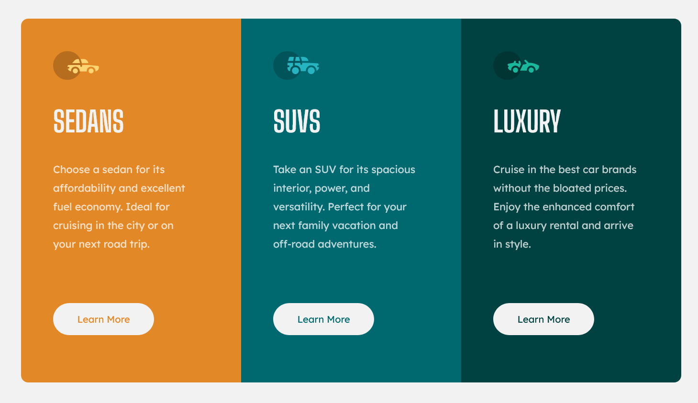

# Frontend Mentor - 3-column preview card component solution

This is a solution to the [3-column preview card component challenge on Frontend Mentor](https://www.frontendmentor.io/challenges/3column-preview-card-component-pH92eAR2-). Frontend Mentor challenges help you improve your coding skills by building realistic projects. 

### Screenshot

### Links

- [Solution](https://www.frontendmentor.io/solutions/3column-preview-card-component-html-css-RD1Xrfe1xq)
- [Live Site](https://lspacka.github.io/FEM-3-column-preview-card-component/)

### Built with

- HTML
- CSS

## Author

- [Frontend Mentor](https://www.frontendmentor.io/profile/lspacka)
- [Twitter](https://www.twitter.com/lspacka)